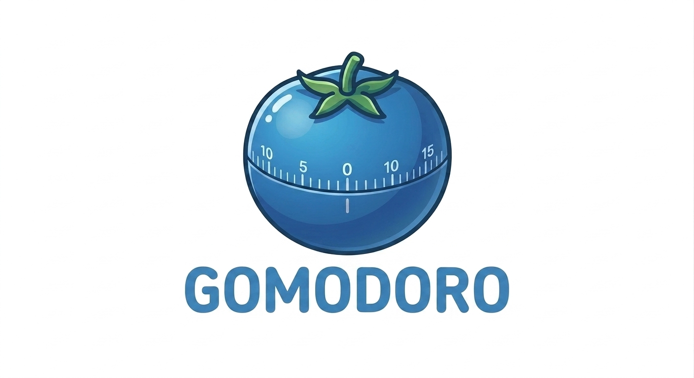

<p align="center">
  
</p>

<p align="center">
  A minimal Pomodoro timer for your terminal.
</p>

<p align="center">
  
  
  
</p>

---

## Features

- Big ASCII clock display
- Configurable focus and break durations
- Session history with timestamps
- Bell sound on session end
- Pause / resume support
- Runs in alternate screen — leaves your terminal clean on exit

## Install

```bash
go install github.com/benitez96/gomodoro/cmd/gomodoro@latest
```

Or build from source:

```bash
git clone https://github.com/benitez96/gomodoro
cd gomodoro
go build -o gomodoro ./cmd/gomodoro
```

## Usage

```bash
gomodoro
```

### Setup screen

| Key | Action |
|-----|--------|
| `←` `→` | Select Focus / Break |
| `↑` `↓` | Adjust minutes |
| `enter` | Start |
| `q` | Quit |

### Timer screen

| Key | Action |
|-----|--------|
| `space` | Pause / Resume |
| `f` | Start focus session |
| `b` | Start break session |
| `r` | Reset |
| `q` | Quit |

## Built with

- [Bubble Tea](https://github.com/charmbracelet/bubbletea) — TUI framework
- [Lip Gloss](https://github.com/charmbracelet/lipgloss) — Styling
- [Oto](https://github.com/ebitengine/oto) — Audio
